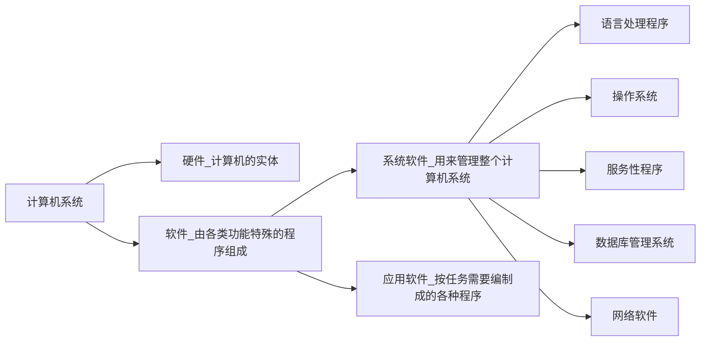
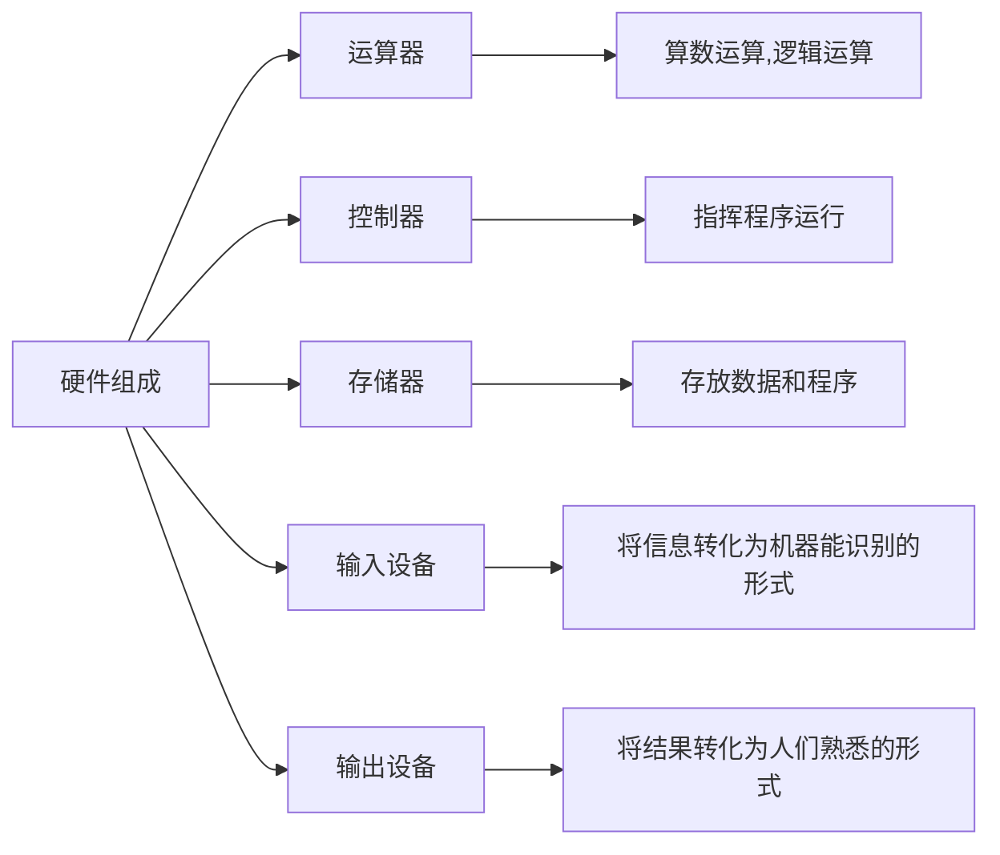
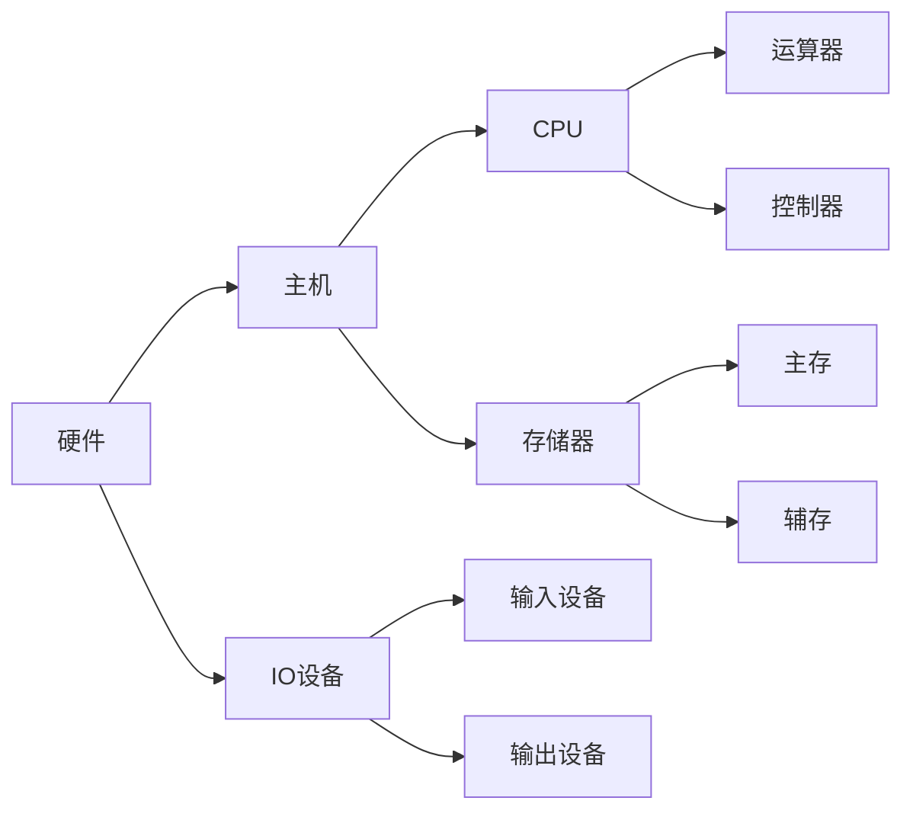

https://www.bilibili.com/video/BV1ix41137Eu?from=search&seid=17192528101127840792

# 计算机系统简介

### 计算机软硬件的概念

#### 计算机系统

------

#### 计算机系统的层次结构

第0级：硬联逻辑级，这是计算机的内核，由门、触发器等逻辑电路组成  
第1级：微程序级，这级的机器语言是微指令集，程序员用微指令编写的微程序，一般是直接由硬件执行的
第2级：传统机器级，这级的机器语言是该级的指令集，程序员用机器指令编写的程序可以由微程序进行解释
第3级：操作系统级，从操作系统的基本功能来看，一方面它要直接管理传统机器中的软硬件资源，另一方面它又是传统机器的延伸
第4级：汇编语言级，这级的机器语言是汇编语言，完成汇编语言翻译的程序叫做汇编程序
第5级：高级语言级，这级的机器语言就是各种高级语言，通常用编译程序来完成高级语言翻译的工作

| 分类           | 主要工作                                                     | 示例             |
| -------------- | ------------------------------------------------------------ | ---------------- |
| 计算机体系结构 | 程序员所见到的计算机系统的属性、概念性的结构与功能特性（指令系统、数据类型、寻址技术、IO机理等） | 有无乘法指令     |
| 计算机组成     | 实现计算机体系结构所体现的属性（具体指令的实现）             | 如何实现乘法指令 |

------

### 计算机的基本组成

#### 冯·诺依曼计算机的特点

1. 计算机由五大部分组成（运算器、存储器、控制器、输入设备和输出设备）
2. 指令和数据以同等地位存于存储器，可按地址寻访
3. 指令和数据用二进制表示
4. 指令由操作码和地址码组成
5. 存储程序
6. 以运算器为中心

------

#### 冯·诺依曼计算机硬件框图

早期的冯·诺依曼计算机是以运算器为核心的

------

#### 现代计算机硬件框图

现代的计算机以存储器为核心，可将一些不常用的数据放于存储器而不是运算器中，减小CPU的负载

------

### 计算机的解题过程

#### 存储器的基本组成

存储体是由存储单元构成，而存储单元是由一个个的存储元件构成，存储元件中则保存着0或1的信息

存储单元：存放一串二进制代码

存储字：存储单元中二进制代码的组合

存储字长：存储单元中二进制代码的位数，每个存储单元赋予一个地址，存储单元是按地址寻访的

------

#### 运算器的基本组成

ALU：算术逻辑单元

ACC：累加器

MQ：乘商寄存器

X:累加寄存器

------

#### 计算机硬件的主要技术指标

1. 机器字长
CPU一次能处理数据的位数，与CPU中的寄存器位数有关

2. 运算速度
$$
\begin{cases}
主频 \\ 
核数，每个核支持的线程数 \\ 
吉普森法 \\
CPI，执行一条指令所需的时钟周期数 \\
MIPS，每秒执行百万条指令 \\
FLOPS，每秒浮点运算次数
\end{cases}
$$

3. 存储容量

   存放二进制信息的位数，主存容量+辅存容量
   
   ------
   
   ****